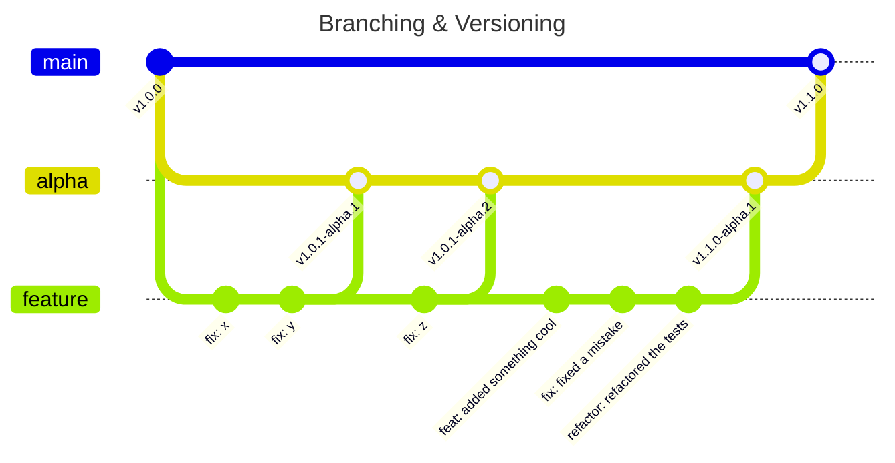
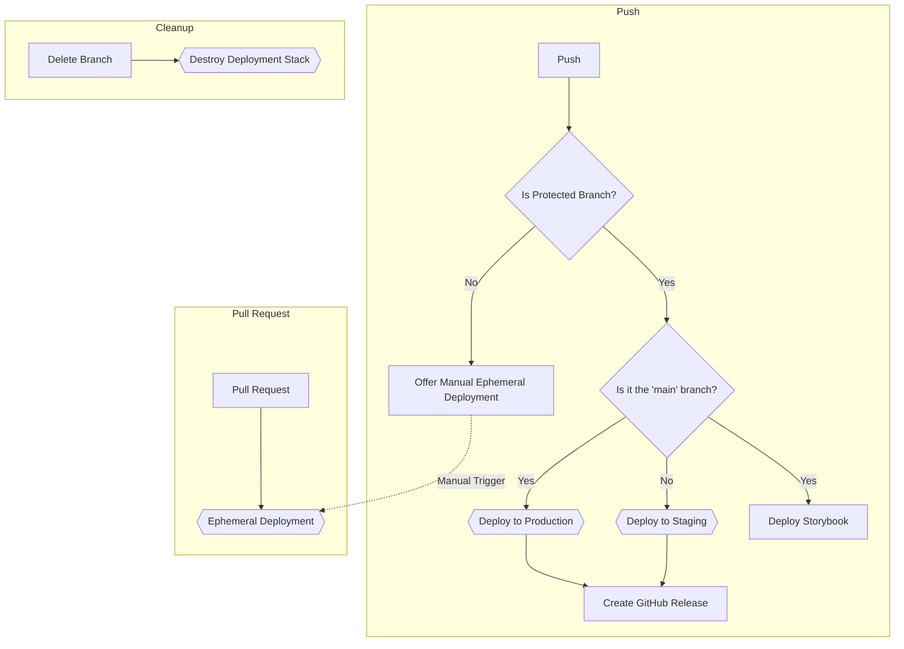

# TRANCE STACK [](https://meza.github.io/trance-stack/)

<!-- initremove:begin -->
> **Warning**
> **This stack is typescript and NPM only for now.**
>
> The NPM requirement comes from the GitHub actions scripts. I will make it possible to use both pnpm and yarn soon, but
> it
> requires a bit more time and I would love to get feedback on the stack until then.

## What's included

This is a [Remix](https://remix.run) stack that offers _a_ way to ship production ready remix applications.
It is constructed in an opinionated way and is meant to be used as a starting point for your own remix projects.
You can modify it to your liking and use it as a base for your own remix projects.

<details>
<summary>📦 Click to see a list of included technologies</summary>

- Good security practices with CSP and sensible auth processes
- i18n with [i18next](https://www.i18next.com/) and its remix
  integration [remix-i18next](https://github.com/sergiodxa/remix-i18next)
- [Auth0](https://auth0.com/) for authentication
- [PostHog](https://posthog.com) for feature flags
- [Sentry](https://sentry.io) for Client Side error tracking (server side soon)
- Custom-built cookie consent banner to maximise security [read more](./docs/adr/0013-custom-cookie-consent.md)
- Analytics Integrations
  - [PostHog](https://posthog.com)
  - [Hotjar](https://hotjar.com)
  - [Google Analytics v4](https://analytics.google.com)
- Static Types with [TypeScript](https://typescriptlang.org)
- Linting with [ESLint](https://eslint.org)
- Unit testing with [Vitest](https://vitest.dev) and [Testing Library](https://testing-library.com)
- End-to-End testing with [Playwright](https://playwright.dev)
- [Conventional Commits](https://www.conventionalcommits.org/en/v1.0.0/) for commit messages to enable automated
  versioning
- [semantic-release](https://github.com/semantic-release/semantic-release) for automatic release management
- [Storybook v7](https://storybook.js.org) for component development
- [NPM](https://docs.npmjs.com/cli) for package management (for now. Will have support for [yarn](https://yarnpkg.com/)
  and [pnpm](https://pnpm.io/) soon)
- [GitHub Actions](https://github.com/features/actions) for a full CI setup
- [AWS](https://aws.com) deployment with [CDK](https://docs.aws.amazon.com/cdk/index.html)
  via [GitHub Actions](https://github.com/features/actions)
  - Using AWS Lambda + Api Gateway + Cloud Front for production builds
  - Using AWS Lambda + Api Gateway for ephemeral builds (for feature branches, pull requests, etc)
- Automatic dependency updates with [Renovate](https://www.mend.io/free-developer-tools/renovate)

</details>

## Using the stack

Create your project with the stack

```bash
npx create-remix@latest --template meza/trance-stack my-app
```

The setup process will ask you for a GitHub repository name.
If you don't have one, don't worry, you can create it after the setup process.

> **Warning**
>
> Read this documentation in your own project's directory **from this point onwards**.
> It will contain links relevant to you as the init script will replace the links in this
> README with the ones customized to your project.

Now start the dev server

```bash
npm run dev
```

This has set you up with a default remix application. It won't function well until you complete the setup process.
You can find the instructions for that [here](#getting-started)

---
<!-- initremove:end -->

## Quickstart

1. Install the dependencies

```bash
npm install
```

2. Start the dev server

```bash
npm run dev
```

3. Go through the [Getting Started](#getting-started) section to set up the local and deployment environments

### Notable npm scripts

- `npm run ci` - run the same verification scripts that are run on CI
- `npm run clean` - removes all generated files
- `npm run clean:all` - removes all generated files and all the node_modules directories
- `npm run dev` - Starts the dev server
- `npm run deploy:dev` - Deploys the application to an ephemeral environment
- `npm run deploy:prod` - Deploys the application to production _(you probably should never use this one locally)_
- `npm run int` - Runs the Playwright integration tests
- `npm run report` - Runs all the things that generate reports for you (coverage, cpd, loc, etc)
- `npm run storybook` - Starts the storybook server
- `npm run validate` - Runs both the CI tests and the integration tests

## Table Of Contents

<!-- TOC -->
<!-- initremove:begin -->

* [What's included](#whats-included)
* [Using the stack](#using-the-stack)<!-- initremove:end -->
* [Quickstart](#quickstart)
  * [Notable npm scripts](#notable-npm-scripts)
* [Table Of Contents](#table-of-contents)
* [Getting Started](#getting-started)
  * [Environment](#environment)
  * [GitHub Settings](#github-settings)
    * [Workflow permissions](#workflow-permissions)
    * [Branch Protection](#branch-protection)
    * [Pages](#pages)
    * [Environments](#environments)
    * [Variables vs. Secrets](#variables-vs-secrets)
    * [GitHub Token - Do This First!](#github-token---do-this-first)
  * [Setup for continuous deployment](#setup-for-continuous-deployment)
  * [Authentication with Auth0](#authentication-with-auth0)
    * [Adding the Auth0 variables to GitHub](#adding-the-auth0-variables-to-github)
    * [Enabling the Auth0 integration for feature branch/PR deployments](#enabling-the-auth0-integration-for-feature-branchpr-deployments)
    * [Removing the Auth0 integration from the application](#removing-the-auth0-integration-from-the-application)
  * [Google Analytics 4 integration](#google-analytics-4-integration)
    * [Removing the Google Analytics 4 integration from the application](#removing-the-google-analytics-4-integration-from-the-application)
  * [Hotjar integration](#hotjar-integration)
    * [Removing the Hotjar integration from the application](#removing-the-hotjar-integration-from-the-application)
  * [PostHog integration](#posthog-integration)
    * [Removing the PostHog integration from the application](#removing-the-posthog-integration-from-the-application)
  * [Renovate bot setup](#renovate-bot-setup)
  * [Sentry integration](#sentry-integration)
    * [How to find the DSN](#how-to-find-the-dsn)
    * [Removing the Sentry integration from the application](#removing-the-sentry-integration-from-the-application)
  * [Split integration](#split-integration)
    * [Removing the Split integration from the application](#removing-the-split-integration-from-the-application)
* [How to use ...?](#how-to-use-)
  * [Authentication](#authentication)
  * [Automated Semantic Versioning](#automated-semantic-versioning)
  * [Branching Strategy with Semantic Versioning](#branching-strategy-with-semantic-versioning)
    * [Linting](#linting)
    * [Which version am I running?](#which-version-am-i-running)
  * [Cookie Consent](#cookie-consent)
    * [Using the consent provider](#using-the-consent-provider)
  * [Dependency Version Updates](#dependency-version-updates)
    * [Runtime dependencies](#runtime-dependencies)
    * [Development dependencies](#development-dependencies)
  * [Deployment](#deployment)
    * [Ephemeral Environments](#ephemeral-environments)
      * [Manual Ephemeral Deployment](#manual-ephemeral-deployment)
      * [Pull Request Ephemeral Deployment](#pull-request-ephemeral-deployment)
    * [Production-like Environments](#production-like-environments)
    * [GitHub Actions](#github-actions)
    * [CDK](#cdk)
      * [Environment Variables](#environment-variables)
        * [Local Environments](#local-environments)
      * [The deployment directory](#the-deployment-directory)
      * [The context variables](#the-context-variables)
      * [Deploying from your local machine](#deploying-from-your-local-machine)
      * [The githubActionSupport.ts file](#the-githubactionsupportts-file)
        * [Testing the GitHub support locally](#testing-the-github-support-locally)
  * [Environment variables](#environment-variables-1)
    * [Adding a new environment variable checklist:](#adding-a-new-environment-variable-checklist)
    * [Bundling environment variables](#bundling-environment-variables)
  * [Feature Flags](#feature-flags)
    * [Production](#production)
    * [The `features.ts` file](#the-featurests-file)
    * [Local development](#local-development)
  * [I18N - Internationalization](#i18n---internationalization)
    * [Using translations](#using-translations)
    * [Adding a new locale](#adding-a-new-locale)
    * [Removing i18n from your project](#removing-i18n-from-your-project)
  * [Lefthook](#lefthook)
  * [NPMIgnore - automated](#npmignore---automated)
  * [Playwright - End-to-end testing](#playwright---end-to-end-testing)
    * [Installing Playwright dependencies](#installing-playwright-dependencies)
    * [Configuring Playwright](#configuring-playwright)
    * [Running the tests](#running-the-tests)
      * [Playwright on GitHub Actions](#playwright-on-github-actions)
      * [Playwright locally](#playwright-locally)
  * [Storybook](#storybook)
    * [Running Storybook](#running-storybook)
    * [Publishing Storybook](#publishing-storybook)
      * [Accessing the published Storybook](#accessing-the-published-storybook)
  * [Styling / CSS](#styling--css)
    * [Shared Component Styles](#shared-component-styles)
    * [Surfacing Styling](#surfacing-styling)
    * [PostCSS](#postcss)
  * [Typescript Paths](#typescript-paths)
    * [Issues with Typescript Paths](#issues-with-typescript-paths)
      * [Vitest](#vitest)
      * [Storybook](#storybook-1)
  * [Unit Testing](#unit-testing)
    * [Globals: true](#globals-true)
    * [Test reporters](#test-reporters)
    * [Setup files](#setup-files)
    * [Threads](#threads)
    * [Coverage](#coverage)<!-- initremove:begin -->
  * [Development of the stack itself](#development-of-the-stack-itself)

<!-- initremove:end -->
<!-- TOC -->

## Getting Started

In order to get this project to work, you will need to have a few things set up first.
<!-- initremove:begin -->
The stack is designed in a way that makes it relatively simple to remove the parts you don't need. You will be able to
find removal instructions at every step so don't worry if you're not a fan of a particular service.
<!-- initremove:end -->
> **But... why?**
>
> **Note**
> We've been
> using [Architecture Decision Records](https://cognitect.com/blog/2011/11/15/documenting-architecture-decisions)
> throughout the development of the project so if you ever find yourself wondering why we've chosen a particular service
> or
> implementation, you can check the [ADR](./docs/adr/decisions.md) page for more information.
>
> We highly encourage you to keep on adding your own decisions. It's a great way to document the historical context of
> your
> project, and it's a great way to share your knowledge with the rest of the team.
>
> We use [adr-tools](https://github.com/meza/adr-tools) to manage our ADRs. It is installed as part of the dependencies,
> so you
> should be able to use it right away.

### Environment

Check the project root directory for a `.env` file. If it's not there, copy the `.env.example` file to `.env`

```bash
cp .env.example .env
```

This file contains all the variables you will need to set for the project to function as is.

The `APP_DOMAIN` should generally stay the same. It's the domain that your application will be served from. This
variable
will also be set by the deployment scripts, so you don't need to worry about it. During local development
it will be set to `http://localhost:3000`.

The `NODE_ENV` variable is used to determine which environment you're running the application in. It seems like ARC has
a
hard time figuring it out on its own, so we've set it up to be set manually. If all goes well, it won't be needed for
long.

The `SESSION_SECRET` variable is used to encrypt the session cookies. It should be a long, random string.

### GitHub Settings

> **Note**
> The project uses GitHub Actions. If you're not familiar with GitHub Actions, you can read more about it
> [here](https://docs.github.com/en/actions).

You need to do a few things to make sure GitHub Actions can work with your project.

#### Workflow permissions

First, head over to https://github.com/meza/trance-stack/settings/actions and under the `Workflow permissions`
section, make sure it's on the `Read and write permissions` option.

Without this, the deployment scripts won't be able to create the necessary GitHub releases.

#### Branch Protection

Next, head over to https://github.com/meza/trance-stack/settings/branches and add a few branch protection rules.

- main
- alpha
- beta

These are the branches that will be used for the different stages of the application. You can set the settings of these
branches however you like, but there's one setting that you need to make sure is unchecked: `Allow deletions`.

<p align="center">
  
</p>

We use this later in the [Deployment](#deployment) section to prevent named environments from being deleted.

#### Pages

Next, head over to https://github.com/meza/trance-stack/settings/pages and make sure the `Source` is set
to `GitHub Actions`.
This will allow us to deploy the project's storybook to GitHub Pages.

#### Environments

> **Note**
> We use GitHub environments to manage the different stages of our application. You can read more about them
> [here](https://docs.github.com/en/actions/deployment/targeting-different-environments).

GitHub environments are great to control the environment variables that are used in your workflows.

For now, go to https://github.com/meza/trance-stack/settings/environments and create the following environments:

- `Production`
- `Staging`
- `Ephemeral`

These are referred to in [the deployment workflow](./.github/workflows/deploy.yml) for example with the `environment`
key.
The `Ephemeral` environment is used for feature branches and pull requests and is referenced
in [the ephemeral workflow](./.github/workflows/ephemeralDeploy.yml).

#### Variables vs. Secrets

Some configuration values are sensitive while others are not. For example, the `COOKIEYES_TOKEN` is not sensitive, but
the
`AUTH0_CLIENT_SECRET` is.
This mainly comes from the fact that some of these values will be embedded into the html of your application and be
visible
to everyone.

> **Warning**
> Please double-check the documentation of the services to ensure you're setting them up correctly.
>
> The application won't work properly if you add a secret as a variable or a variable as a secret.

### GitHub Token - Do This First!

For the releases to work properly, you will need
to [create a Personal Access Token](https://docs.github.com/en/authentication/keeping-your-account-and-data-secure/creating-a-personal-access-token).
It needs the following settings:

- Expiration: never
- Scopes
  - [repo](https://github.com/settings/tokens/new?scopes=repo) for private repositories
  - [public_repo](https://github.com/settings/tokens/new?scopes=public_repo) for public repositories

Once you've created the token, go to the [secrets settings][gh-secrets] and add it as `GH_TOKEN`

### Setup for continuous deployment

The deployment processes are described in the [Deployment](#deployment) section but to get you started, please
create the environment variables and secrets defined in the [environment variables](#environment-variables) section.

### Authentication with Auth0

We use [Auth0 for authentication](./docs/adr/0010-authentication-is-done-by-auth0.md).
You will need to create an account with them
and [set up an application](https://auth0.com/docs/get-started/auth0-overview/create-applications).

When creating your new application, make sure to set the following settings:

1. The application type should be `Regular Web Applications`
2. Ignore the Quick Start section
3. Go to Settings and copy the `Domain` and `Client ID` and `Client Secret` and paste them in the `.env` file
4. Set the Token Endpoint Authentication Method to `Post`
5. Go to the `Allowed Callback URLs` section and add `http://localhost:3000/auth/callback`
6. Go to the `Allowed Logout URLs` section and add `http://localhost:3000`
7. Go to the `Allowed Web Origins` section and add `http://localhost:3000`
8. Go to the `Allowed Origins (CORS)` section and add `http://localhost:3000`
9. Go to the `Refresh Token Rotation` section and enable it and with that, you also have to enable
   the `Absolute Expiration`
   option.

#### Adding the Auth0 variables to GitHub

Now that you have your Auth0 variables, you will need to add them to the GitHub environments you created above.

Go to the [secrets settings][gh-secrets] and add the Auth0 secrets with the same name as the
variables in the `.env` file.

You can set custom values for every environment if you want to. For example, you can set the `AUTH0_DOMAIN` to
`dev-123456.eu.auth0.com` for the `Staging` environment and `prod-123456.eu.auth0.com` for the `Production` environment.

But for the sake of simplicity, you can just set the same values only once in the main Actions secrets page, and it will
be used for all environments.

#### Enabling the Auth0 integration for feature branch/PR deployments

If you want to enable the Auth0 integration for feature branch/PR deployments, you will need to do a few extra steps.
Since the feature branch/PR deployments are ephemeral, they will have a different domain name every time they are
deployed. This means that you will need to add the domain name to the `Allowed Callback URLs` and `Allowed Logout URLs`

To make this painless, we can use the `*` wildcard in the domain name. This will allow any domain name to be used.

During the initial setup above, you have added `http://localhost:3000` in a few places.
You will need to add `,https://*.execute-api.us-east-1.amazonaws.com` to the same places.
_(Note the comma at the beginning. Domains need to be separated by commas)_

> **Note**
> You will need to replace the `us-east-1` part with the region you're using.

For example, the Allowed Callback URLs section should look like this:

```text
http://localhost:3000/auth/callback,https://*.execute-api.us-east-1.amazonaws.com/auth/callback
```

> **Warning**
>
> The `*` wildcard will allow you to use as wide of a domain name as you would like to. This however comes at the cost
> of security. We would highly recommend creating an alternative tenant on Auth0 for your feature branch/PR deployments.

#### Removing the Auth0 integration from the application

1. Delete the `AUTH0_DOMAIN`, `AUTH0_CLIENT_ID` and `AUTH0_CLIENT_SECRET` variables from the `.env` file and GitHub
   secrets.
2. Delete the `src/auth.server.ts` and the `src/auth.server.test.ts` files.
3. Delete the `auth0-remix-server` dependency from the `package.json` file.
4. Follow the compilation and test errors to remove all the code that uses the `auth0-remix-server` dependency.

### Google Analytics 4 integration

We use [Google Analytics v4](https://analytics.google.com) for analytics. You will need to create an account with them
and [set up a property](https://support.google.com/analytics/answer/1008015?hl=en).

When you are done setting up your property, you will need to copy the `Measurement ID` of your Data Stream and paste
set the `GOOGLE_ANALYTICS_ID` variable in the `.env` file.

You will also have to go to the [variables settings][gh-variables] and add the same variable
name as the one in the `.env` file.

> **Warning**
> The `GOOGLE_ANALYTICS_ID` is **set as a variable** for the actions.

#### Removing the Google Analytics 4 integration from the application

1. Delete the `GOOGLE_ANALYTICS_ID` variable from the `.env` file and GitHub variables.
2. Delete the `src/components/GoogleAnalytics` directory.
3. Delete the relevant types off the `appConfig` type in the `src/types/global.d.ts` file.
4. Delete the `<GoogleAnalytics ... />` component and its import from the `src/root.tsx` file.
5. Run `vitest --run --update` to update the snapshots.

### Hotjar integration

We use [Hotjar](https://www.hotjar.com) for heatmaps and user recordings. You will need to create an account with them
and set up a new site.

When you have your site set up, head to https://insights.hotjar.com/site/list and copy the ID of your site and paste
set the `HOTJAR_ID` variable in the `.env` file.

You will also have to go to the [variables settings][gh-variables] and add the same variable
name as the one in the `.env` file.

> **Warning**
> The `HOTJAR_ID` is **set as a variable** for the actions.

#### Removing the Hotjar integration from the application

1. Delete the `HOTJAR_ID` variable from the `.env` file and GitHub variables.
2. Delete the `src/components/Hotjar` directory.
3. Delete the relevant types off the `appConfig` type in the `src/types/global.d.ts` file.
4. Delete the `<Hotjar ... />` component and its import from the `src/root.tsx` file.
5. Run `vitest --run --update` to update the snapshots.

### PostHog integration

We use [PostHog](https://posthog.com) for analytics. You will need to create an account with them
and set up a new project.

When you have your project set up, head to https://posthog.com/project/settings and copy the API key of your project and paste
set the `POSTHOG_TOKEN` variable in the `.env` file.
You also need to set the `POSTHOG_API` variable to either `https://eu.posthog.com` or `https://posthog.com` depending on your
data residency preferences.

You will also have to go to the [variables settings][gh-variables] and add the same variable names as the one in the `.env` file.

#### Differentiating between environments

In PostHog, your main unit is called an Organization. An organization can have multiple "projects" which are
essentially environments. For example, you can have a `production` project and a `staging` project.

This allows you to have different feature flags, users and data for each environment. Feel free to create a new
project for each environment and then set the appropriate environment variables.

#### Removing the PostHog integration from the application

1. Delete the `POSTHOG_TOKEN` and `POSTHOG_API` variables from the `.env` file and GitHub variables.
2. Delete the `src/components/Posthog` directory.
3. Delete the relevant types off the `appConfig` type in the `src/types/global.d.ts` file.
4. Delete the `<Posthog ... />` component and its import from the `src/root.tsx` file.
5. Run `vitest --run --update` to update the snapshots.
6. Delete the `posthog` dependency from the `package.json` file.
7. Follow the compilation and test errors to remove all the code that uses the `posthog` dependency.

### Renovate bot setup

We use [Renovate](https://www.mend.io/free-developer-tools/renovate) to manage dependency updates.
To take advantage of it, you will need to install
the [Renovate GitHub App](https://docs.renovatebot.com/getting-started/installing-onboarding/#hosted-githubcom-app).

First, navigate to https://github.com/apps/renovate and click on the Install button.

<p align="center">
  
</p>

On the following screen, we recommend selecting "All repositories" to make life easier, but you can configure it to only
work on the repository you're currently in.

<p align="center">
  
</p>

### Sentry integration

> **Note**
> Due to compatibility issues with Architect, the server-side instrumentation of Sentry is not
> working for now.
> Keep an eye on [this issue](https://github.com/getsentry/sentry-javascript/issues/6062) for
> updates.
> The relevant code is commented out in the `entry.server.tsx` file.

We use [Sentry](https://sentry.io) for error reporting. You will need to create an account with them
and set up a new project.

When you have your project set up, head to the project settings and copy the `DSN` and paste it
set the `SENTRY_DSN` variable in the `.env` file.

You will also have to go to the [variables settings][gh-variables] and add the same variable
name as the one in the `.env` file.

Next, head over to https://sentry.io/settings/account/api/auth-tokens/ and create a new token.
You will need `project:releases` and `project:read` permissions.

Once you have the token, go to the [secrets settings][gh-secrets] and add

- `SENTRY_AUTH_TOKEN` - the token you just created
- `SENTRY_ORG` - the organization slug
- `SENTRY_PROJECT` - the project slug

We will be using these to send the source maps to Sentry so that the errors are properly mapped to the source code.

The deployment script will automatically upload the source maps to Sentry and then remove them locally, so they don't
get
uploaded to the environments.

#### How to find the DSN

First, Go to the project settings

<p align="center">
  
</p>

Then on the sidebar, click on the `Client Keys (DSN)`

<p align="center">
  
</p>

Finally, copy the `DSN` value

#### Removing the Sentry integration from the application

1. Delete the `SENTRY_DSN` variable from the `.env` file and GitHub variables.
2. Run `npm remove @sentry/*` to remove all the sentry packages.
3. Remove the `sentryDsn` from the `appConfig` and the `SENTRY_DSN` from the `ProcessEnv` type in
   the `src/types/global.d.ts` file.
4. On the very bottom of the `src/root.tsx` file, replace the `withSentry(App)` with `App`.
5. Remove the `Sentry.init` call from the `src/entry.client.tsx` and the `src/entry.server.tsx` files.
6. Follow the compilation and test errors to remove all the code that uses Sentry.
7. Open the `.github/workflows/deploy.yml` and the `.github/workflows/ephemeralDeply.yml` files and remove
   the `Sentry Sourcemaps` step.

---

## How to use ...?

This section dives deeper into the concepts present in the stack.

### Authentication

The authentication is done via the [auth0-remix-server](https://github.com/meza/auth0-remix-server) package.
The README file in that package has all the information you need to understand how it works.

### Automated Semantic Versioning

We use [Conventional Commits](https://www.conventionalcommits.org/en) to automatically determine the next
version of the package. It uses the [semantic-release](https://semantic-release.gitbook.io/semantic-release) package to
automate the versioning and release process.

The functionality is controlled by the `.releaserc.json` file.
Since the projects that are created from this stack are most likely aren't going to be npm libraries, the npm publishing
plugin is not included in the configuration.

To effectively use conventional commits, you need to understand the following basic principle:

**Your commit messages determine if a new deployment happens to production.**

Messages that trigger builds are:

- `fix: ...` - fixes a bug
- `feat: ...` - adds a new feature

Messages that don't trigger new versions (therefore builds) are:

- `docs: ...` - changes to the documentation
- `chore: ...` - changes to the build process or auxiliary tools and libraries such as documentation generation
- `refactor: ...` - code changes that neither fixes a bug nor adds a feature
- `style: ...` - changes that do not affect the meaning of the code (white-space, formatting, missing semi-colons, etc)
- `test: ...` - adding missing tests or correcting existing tests
- `ci: ...` - changes to the CI configuration files and scripts
- `perf: ...` - a code change that improves performance

### Branching Strategy with Semantic Versioning

We will talk about how the deployment works in the [Deployment](#deployment) section. For now, let's look at how the
branching strategy works with the versioning.

There are 3 main branches:

- `main` - this is the main branch. It is the branch that is deployed to production.
- `beta` - this is the branch that is deployed to the beta (Staging) environment.
- `alpha` - this is the branch that is deployed to the alpha (Staging) environment.

When you push to the `main` branch, a new version is released to production. The version is determined by the commit
messages
and every commit that is pushed to the `main` branch will trigger a new version.

When you push to the `alpha` or `beta` branch, a
new [Pre-release](https://semantic-release.gitbook.io/semantic-release/usage/workflow-configuration#pre-release-branches)
version is created. This allows you to iterate on features for an upcoming release and not worry about bumping the
version
number every time you push a commit that introduces a new feature or a fix.

For example, if you have a `1.0.0` version in production, and you push a commit to the `alpha` branch, the version will
be
`1.1.0-alpha.0`. If you push another commit to the `alpha` branch, the version will be `1.1.0-alpha.1` and so on.

When you merge a pull request from the `alpha` or `beta` branch to the `main` branch, all the changes in those branches
will be collected and bundled into a single release. To follow the example above, if you have a `1.0.0` version in
production,
and merge the `alpha` branch with its `1.1.0-alpha.1` version, your newly created version on production will be `1.1.0`.



#### Linting

We use [commitlint](https://commitlint.js.org/#/) to lint the commit messages. The configuration is in the
`package.json` file.
The linting happens whenever you make a commit. If the commit message doesn't follow the conventional commits format,
the commit will fail.

The linting itself is triggered by [lefthook](#lefthook)

#### Which version am I running?

The version of the app is sent into the `<html data-version="...">` attribute. You can use this to determine which
version
of the app is running on any given environment.

### Cookie Consent

We have built a custom cookie consent solution that is compatible with secure XSS protection practices as well as with
the EU cookie law.

> **Note**
> you can read more about this in the [Cookie Consent ADR](./docs/adr/0001-cookie-consent.md)

The solution is in the `src/components/CookieConsent` folder, and **it is meant to be modified to fit your needs.**

When you open up the `_index.tsx` file there, you can see the following interfaces:

```ts
interface ConsentData {
  analytics?: boolean | undefined;
  //add your own if you need more
  // marketing?: boolean | undefined;
  // tracking?: boolean | undefined;
}

interface CookieConsentContextProps {
  analytics?: boolean | undefined;
  setAnalytics: (enabled: boolean) => void;
  //add your own if you need more
  // marketing?: boolean | undefined;
  // setMarketing: (enabled: boolean) => void;
  // tracking?: boolean | undefined;
  // setTracking: (enabled: boolean) => void;
}
```

You will need to modify these in order to add your specific cookie types. For example, if you want to add a `marketing`
cookie, you will need to add the following:

```ts
interface ConsentData {
  analytics?: boolean | undefined;
  marketing?: boolean | undefined;
}

interface CookieConsentContextProps {
  analytics?: boolean | undefined;
  setAnalytics: (enabled: boolean) => void;
  marketing?: boolean | undefined;
  setMarketing: (enabled: boolean) => void;
}
```

#### Using the consent provider

In order to adhere to the cookie consent, you will need to identify the elements of your project that add a specific
type of cookie.

> A good example in this stack is the GoogleAnalytics component. It is located in the `src/components/GoogleAnalytics`

The cookie consent provider is use in the `root.tsx` file, so it's available for all your components.
To use it, all you need to do is:

```tsx
const { analytics } = useContext(CookieConsentContext);

if (analytics) {
  //add your analytics code here
}
```

### Dependency Version Updates

We use [Renovate](https://www.mend.io/free-developer-tools/renovate) to automatically update the dependencies.
The configuration is in the `.github/renovate.json` file.

By default, it is configured to update the dependencies according to some basic rules:

#### Runtime dependencies

> Runtime dependencies are the `dependencies` section in the `package.json` file

Runtime dependencies are the libraries we use to run the application. This also means that security and bug fixes are
important for these dependencies.

We want to update these dependencies as soon as possible, so we have the following configuration:

- `minor and patch versions` - create a pull request with a `fix: ` prefix in the commit message and merge automatically
  if possible
- `major versions` - create a pull request with a `fix: ` prefix in the commit message and do NOT merge automatically

#### Development dependencies

> Development dependencies are the `devDependencies` section in the `package.json` file

Development dependencies are the libraries we use to develop the application. This means that we don't need to release
a new version of the app when we update these dependencies.

We still want to update these dependencies as soon as possible, so we have the following configuration:

- `minor and patch versions` - create a pull request with a `chore: ` prefix in the commit message and merge
  automatically if possible
- `major versions` - create a pull request with a `chore: ` prefix in the commit message and do NOT merge automatically

### Deployment

<!-- initremove:begin -->
One of the main focuses of this stack was to create a deployment strategy that is a good starting point for anyone
building from this stack.
<!-- initremove:end -->
We use a combination of [GitHub Actions](#github-actions) and [AWS CDK](#cdk) to deploy the application to both the
production-like and ephemeral environments.

#### Ephemeral Environments

Ephemeral environments are environments that are created on-demand and destroyed when they are no longer needed.
We use these for feature branches and pull requests.

They are automatically created for pull requests, but you will have to manually trigger one if you just want to deploy
a feature branch.

##### Manual Ephemeral Deployment

Navigate to https://github.com/meza/trance-stack/actions/workflows/ephemeralDeploy.yml and click the "Run workflow"
button.

<p align="center">
  
</p>

Once you have chosen a branch, it will start building the application and deploying it to the ephemeral environment.

When the process is finished, it will publish a summary to the run's Summary Dashboard with the link to the deployed
application. It will look something like this:

<p align="center">
  
</p>

##### Pull Request Ephemeral Deployment

When you create a pull request, GitHub Actions will automatically create an ephemeral environment for you and the
deployment link will be added to the pull request as a comment.

#### Production-like Environments

Production-like environments are environments that are created once and then updated when the application is updated.

The branch `main` is considered to be the production branch while `alpha` and `beta` are considered to be staging.

This is decided in the `deploy.yml` file:

```yaml
  build:
    environment: ${{ github.ref_name == 'main' && 'Production' || 'Staging' }}
```

The `Production` and `Staging` words here directly reference the [GitHub Environments](#environments) that we have
configured.

> **Warning**
> This means that both the `alpha` and `beta` branches will be deployed to the `Staging` environment.
<!-- initremove:begin -->
This was done for convenience with the stack, but you are highly encouraged to change this to suit your needs.
Maybe add a separate `alpha` environment?
<!-- initremove:end -->

> **Note**
> Remember that the GitHub Environments hold the environment variables used for that given workflow. This means that you
> can set a different `APP_URL` for each environment among other things like a separate Auth0 tenant.

#### GitHub Actions

GitHub Actions respond to various events in the repository's lifecycle.
The diagram below shows the flow of the deployment process.



The hexagonal nodes are processes which are executed by [CDK](#cdk) while the others are handled with GitHub Actions.

#### CDK

[AWS Cloud Development Kit (CDK)](https://docs.aws.amazon.com/cdk/index.html) is an open-source software development
framework to define cloud infrastructure in code and provision it through AWS CloudFormation.

> **Note**
> If you are interested in why we chose CDK, check
> out [the relevant ADR](./docs/adr/0008-use-aws-cdk-for-deployments.md)

The majority of the infrastructure is defined in the `deployment` directory. The `deployment/lib` directory contains the
custom [Constructs](https://docs.aws.amazon.com/cdk/v2/guide/constructs.html) that are used to build the infrastructure.

##### Environment Variables

In order to deploy the application, you will need to set the following environment variables:

| [Variable][gh-variables] | [Secret][gh-secrets]  | Description                                               |
|--------------------------|-----------------------|-----------------------------------------------------------|
|                          | AWS_ACCESS_KEY_ID     | The AWS access key ID used to deploy the application.     |
|                          | AWS_CERT_ARN          | The ARN of the certificate used for the domain.           |
|                          | AWS_SECRET_ACCESS_KEY | The AWS secret access key used to deploy the application. |
| AWS_DOMAIN_NAME          |                       | The final domain name of the application.                 |
| AWS_HOSTED_ZONE_NAME     |                       | The name of the hosted zone in Route53.                   |

If you came here from the top of the document, [go back to where you were](#setup-for-continuous-deployment) and
continue from there.

###### Local Environments

If you want to deploy the application locally, you will need to set the `AWS_ACCESS_KEY_ID` and `AWS_SECRET_ACCESS_KEY`
environment variables only.

##### The deployment directory

The `deployment/stacks` directory contains the actual stacks that are deployed to AWS. Their naming should be
self-explanatory.
We have one for the `Ephemeral` environment and one for the `Production` environment.

If you examine either of the deployment files, you will notice that the deployment is basically
a single command:

```bash
 npx cdk deploy remix-trance-stack-ephemeral -O /tmp/deployment.result.json \
 --require-approval never \
 --context environmentName=${{ env.REF_NAME }} \
 --context domainName=${{ vars.AWS_DOMAIN_NAME }} \
 --context certificateArn=${{ secrets.AWS_CERT_ARN }} \
 --context hostedZoneName=${{ vars.AWS_HOSTED_ZONE_NAME }}
```

The difference between the ephemeral and the production deployments is the name of the stack.
It can be either `remix-trance-stack-ephemeral` or `remix-trance-stack-production`.

##### The context variables

The context variables are used to pass information to the CDK stack.

| Variable          | Description                                                                                                  | Example                                                                          |
|-------------------|--------------------------------------------------------------------------------------------------------------|----------------------------------------------------------------------------------|
| `environmentName` | The name of the environment. This is used to create derive the name of every single resource created on AWS. | feature1                                                                         |
| `domainName`      | The domain name of the application.                                                                          | trance-stack.vsbmeza.com                                                         |
| `certificateArn`  | The ARN of the certificate used for the application.                                                         | arn:aws:acm:region:123456789012:certificate/12345678-1234-1234-1234-123456789012 |
| `hostedZoneName`  | The name of the hosted zone used for the application.                                                        | vsbmeza.com                                                                      |

> The `domainName`, `certificateArn` and `hostedZoneName` are only used for Production deployments.

> **Note**
> Even though some context variables are only used for production deployments, they are still passed to the
> ephemeral deployment. This is because the CDK stack is the same for both environments and the evaluation of the
> context variables is done at runtime.
> For ephemeral deployments you can have an empty string for the `domainName`, `certificateArn` and `hostedZoneName`.

##### Deploying from your local machine

We advise you to use the GitHub Actions to deploy the application. However, if you want to deploy from your local
machine,
you can do so by running the same command as the deployment scripts would.

> **Warning**
> Don't forget to run `npm run build` before deploying.

You can define the context variables either on the command line or you can use the `cdk.context.json` file.

```json
{
  "environmentName": "localdev",
  "domainName": "trance-stack.example.com",
  "hostedZoneName": "example.com",
  "certificateArn": "arn:aws:acm:region:123456789012:certificate/12345678-1234-1234-1234-123456789012"
}
```

##### The githubActionSupport.ts file

Let's talk about the `githubActionSupport.ts` file.

This file uses the GitHub Actions toolkit to allow us to report back with the deployment URL to the GitHub Actions/Pull
Request.

The reason it's a bit more complex than it needs to be is because we don't want to publish a PR comment every time we
deploy the same branch. Since the URL won't change for a branch that's already deployed, there is no need to spam the
PR.

This posed a challenge of finding an existing deployment comment and updating it instead of creating a new one.

###### Testing the GitHub support locally

If for whatever reason you would like to get a local output of the GitHub Actions support, you can do so by running the
following command:

```bash
npx ts-node --prefer-ts-exts deployment/githubActionSupport.ts /tmp/deployment.result.json
```

This requires you to have a `deployment.result.json` file in the `/tmp` directory. You can get this file by running the
[deployment command locally](#deploying-from-your-local-machine).

The results will be added to the `deploymentSummary.md` file.

### Environment variables

Environment variables are probably the biggest pain-point in the maintenance of this project.
You have to add them to GitHub, add them to the deploy scripts and add them to the `.env` file.

We're working on a solution to this, but for now, you have to do it manually.

#### Adding a new environment variable checklist:

Add the variable to...

- [ ] the `.env` file
- [ ] the `.env.example` script. **This is very important**
- [ ] the `.github/workflows/deploy.yml` script to the `npm run build` command
- [ ] the `.github/workflows/ephemeralDeploy.yml` script to the `npm run build` command
- [ ] the `.github/workflows/ephemeralDestroy.yml` script to the `npm run build` command
- [ ] the `.github/workflows/playwright.yml` script to the `Create Envfile` section

#### Bundling environment variables

We bundle most of the environment variables into the server bundle. To understand why,
read [the relevant adr](./docs/adr/0005-bundling-environment-variables.md),
and [it's addendum](./docs/adr/0009-no-more-need-to-bundle-environment-variables.md).

The important thing to know is that what gets bundled is decided by reading the `.env.example` file and taking its
keys.

You can prevent certain keys to get bundled by adding them to the deny list in the `remix.config.js` file.

```js
  const doNotBundleEnv = [
  'APP_DOMAIN' // deny list for the environmentPlugin
]
```

### Feature Flags

Feature flags are a fantastic way to test new features in production without having to worry about breaking anything.
It enables you to decouple the release of new code from the release of new
features. [Read more](https://posthog.com/docs/feature-flags/manual)

Let's look at an example which is in the `src/routes/_index.tsx` file

```tsx
export const loader: LoaderFunction = async ({ request, context }) => {
  const isAuth = await hasFeature(request, Features.AUTH);
  return json({
    isHelloEnabled: await hasFeature(request, Features.HELLO),
    isAuthEnabled: isAuth
  });
};

export default () => {
  const { isHelloEnabled, isAuthEnabled } = useLoaderData<typeof loader>();
  if (isHelloEnabled) {
    return (<div>
      <Hello/>
      {isAuthEnabled ? <Login/> : null}
    </div>);
  }
  return <div>Goodbye World!</div>;
};
```

Here all elements of the page are wrapped in a feature flag. The `Hello` component will only be rendered if the `HELLO`
feature is enabled. The `Login` component will only be rendered if the `AUTH` feature is enabled.

#### Differentiating between environments

In PostHog, your main unit is called an Organization. An organization can have multiple "projects" which are
essentially environments. For example, you can have a `production` project and a `staging` project.

This allows you to have different feature flags, users and data for each environment. Feel free to create a new
project for each environment and then set the appropriate environment variables.

### I18N - Internationalization

We're using i18next for internationalization. You can read more about it in
the [i18next documentation](https://www.i18next.com/).
To integrate it with Remix, we're using the [remix-i18next](https://github.com/sergiodxa/remix-i18next) package and our
setup
is based on the remix-i18next Readme file.

You can find the i18n configuration in the `src/i18n` directory. The `i18n.config.ts` file contains the configuration
for
the defaults of i18next. The `i18n.server.ts` file contains the configuration for the server side while
the `i18n.client.ts`
file contains the configuration for the client side.

The only deviation we have from the remix-i18next sample setup is that we're actually bundling the translations into the
server package. This is done in the `src/i18n/i18n.server.ts` file.

```ts
await i18nextInstance.init({
  debug: process.env.I18N_DEBUG === 'true',
  ...baseConfig,
  lng: locale,
  ns: remixI18next.getRouteNamespaces(remixContext),
  // The sample setup in remix-i18next
  //backend: {
  //  loadPath: resolve("./public/locales/{{lng}}/{{ns}}.json"),
  //},
  resources: {
    en: {
      translation: en
    }
  }
});
```

We're doing this because in the [AWS Lambda](https://aws.amazon.com/lambda/) environment, we have one single file as the
handler, and it needs to be self-contained. While traditional lambda functions could have access to attached file
systems,
it would make deployments more complicated and the function would become incompatible
with [Lambda@Edge](https://aws.amazon.com/lambda/edge/) solutions.

Therefore, instead of using the `fs-backend`, we're directly importing the resources from the `public/locales`
directory.

This does mean that when you add a new locale, you will have to add it to the resources in the `i18n.server.ts` file.

#### Using translations

To use translations in your application, you can use the `useTranslation` hook from the `react-i18next` package.

```tsx
import { useTranslation } from 'react-i18next';

export const Hello = () => {
  const { t } = useTranslation();
  return (
    <h1 data-testid={'greeting'} className={'hello'}>{t('microcopy.helloWorld')}</h1>
  );
};
```

You can also [pass in variables](https://www.i18next.com/translation-function/interpolation#working-with-data-models) to
the translations. This helps the translators to create more context-sensitive translations.

Take this example from the initial logged in Dashboard of the application:

```tsx
export default () => {
  const { t } = useTranslation();
  const { user } = useLoaderData<typeof loader>();
  return (<>
    <div>{t('dashboard.for', { name: user.nickname || user.givenName || user.name })}<br/><Logout/></div>
  </>);
};
```

Here we pass in the `name` variable to the translation. This means that the location of where the name appears in the
final
text can be different in different languages. For example, in one context we could say "Dashboard for John!" and in
another context
we could say "John's dashboard!".

The translation file in our dashboard's case looks like this:

```json
{
  "dashboard": {
    "for": "Dashboard for {{ name }}"
  }
}
```

#### Adding a new locale

To add a new locale, you will have to do the following:

1. Add the new locale to the `public/locales` folder. Follow the example of the existing locale(s)
2. Add the new locale to the `resources` object in the `i18n.server.ts` file.
3. Add the new locale to the `supportedLngs` array in the `i18n.config.ts` file.

#### Removing i18n from your project

If you don't want to use i18n, you can remove it from your project. You will have to do the following:

1. Remove the `i18n` folder from the `src` directory
2. Remove the `locales` folder from the `public` directory
3. Run `npm remove i18next i18next* *i18next`
4. Remove the `<<I18nextProvider ...>` from both the `src/entry.server.tsx` and `src/entry.client.tsx` files
5. Follow the compilation errors and remove any remaining references to i18n

> **Note**
>
> There are some great tips about organising your translations in the
> [i18n Readme file](./src/i18n/README.md).

### Lefthook

The commit validation and the automatic dependency installation is done
by [Lefthook](https://github.com/evilmartians/lefthook)

The configuration file is at `.lefthook.yml`.
You can see all the commands that happen and the git hooks they are attached to.

If running all the tests at every commit is too much, you can always set it to happen on pre-push instead.

### NPMIgnore - automated

In case you would ever want to publish your project to NPM (which you shouldn't), you can use
the [npmignore](https://www.npmjs.com/package/npmignore) package to
automatically generate an `.npmignore` file. This file will be generated based on the `.gitignore` file.

There is a basic ignore configuration in the `package.json` file's `publishConfig` section.

### Playwright - End-to-end testing

We use Playwright for our end-to-end tests. Playwright is a successor to Cypress and Puppeteer. It's maintained by
Microsoft and is a cross-browser testing tool. It's also a lot faster than Cypress.

Learn more about Playwright [here](https://playwright.dev/docs/intro).

#### Installing Playwright dependencies

Playwright requires a few dependencies to be installed in order to run locally. You can install them by running the
following command:

```bash
npx playwright install --with-deps
```

#### Configuring Playwright

The tests are located in the `playwright/e2e` directory. Feel free to change the directory structure to your liking.
If you do so, don't forget to update the test location in the `playwright.config.ts` file.

```ts
export default defineConfig({
  testDir: './playwright/e2e', // <-- Update this
```

**You do not need to start the dev server before running the tests.**

Playwright will start the dev server for you. It is configured in the `playwright.config.ts` file right
at the bottom:

```ts
  /* Run your local dev server before starting the tests */
webServer: {
  command: 'npm run dev',
    url
:
  'http://localhost:3000',
    timeout
:
  1 * 60 * 1000,
    reuseExistingServer
:
  !process.env.CI
}
```

#### Running the tests

##### Playwright on GitHub Actions

Every time you open a pull request to the `main` branch, the tests will be run on GitHub Actions.

##### Playwright locally

You can run the tests locally by running the following command:

```bash
npm run int
```

The reports will go to the `reports/e2e` directory.

### Storybook

We use [Storybook V7](https://storybook.js.org/releases/7.0) with Webpack 5.
Remix is still a bit behind in terms of Storybook support, so we had to do a few things to get it to work.

> **Warning**
> Storybook 7 brings some fundamental changes to how Storybook works.
> It is **HIGHLY** encouraged that you read
> the [migration guide](https://github.com/storybookjs/storybook/blob/next/MIGRATION.md#from-version-65x-to-700)
> to see what changed. Things that you are used to might not work the same way anymore.

There is an [ongoing discussion](https://github.com/remix-run/remix/discussions/2481) within the Remix community
about how to best solve this issue.

This code doesn't include the remixStub yet, but it might change soon.

> If you know how to configure it properly, please open a PR.

#### Running Storybook

You can run Storybook by running the following command:

```bash
npm run storybook
```

If you're looking for inspiration on how to organise your stories, you can check out the
[Telekom Scale project](https://telekom.github.io/scale/?path=/docs/scale-design-system--page)

#### Publishing Storybook

Remember when we set up [Pages](#pages) at the beginning?

Storybook automatically gets published to GitHub Pages when you push to the `main` branch.

This is done via the `.github/workflows/storybook.yml` workflow.

##### Accessing the published Storybook

Right at the top of this README, you can see a badge linking to the published Storybook.

### Styling / CSS

We use regular stylesheets in this project which means a combination
of [Shared Component Styles](#shared-component-styles)
and [Surfacing Styling](#surfacing-styling).

#### Shared Component Styles

The shared component styles live in the `src/styles` directory. They are imported in the routes that use them.

```ts
// src/root.tsx
import styles from './styles/app.css';

export const links: LinksFunction = () => {
  return [
    { rel: 'stylesheet', href: styles }
  ];
};
```

The styles that are uniform across the entire application are loaded from the `src/root.tsx` file while the styles that
are
specific to a single route are loaded from the route itself.

These are all additive, so you can have a single stylesheet that is loaded on every route via the `root.tsx`, and then
additional stylesheets that are loaded on specific routes.

If you need a component-specific stylesheet, you can use the [Surfacing Styling](#surfacing-styling) method.

#### Surfacing Styling

To have local styles per component, we use
is [Surfacing Styling](https://remix.run/docs/en/main/guides/styling#surfacing-styles).

> _Because these are not routes, and therefore not associated with a URL segment, Remix doesn't know when to prefetch,
> load, or unload the styles. We need to "surface" the links up to the routes that use the components_

This solution is a bit more complex, but it allows us to have styles that are only loaded when the component is loaded.

Take the `Hello` component as an example:

```tsx
import { useTranslation } from 'react-i18next';
import styles from './hello.css';

export const links = () => [
  { rel: 'stylesheet', href: styles }
];

export const Hello = () => {
  const { t } = useTranslation();
  return (
    <h1 data-testid={'greeting'} className={'hello'}>{t('microcopy.helloWorld')}</h1>
  );
};

export default Hello;
```

Notice that it imports the `hello.css` file. This file is located in the same directory as the component.
It also has a `links` export that returns the stylesheet link.

In Remix terms however, a component is not a route, so we need to "surface" the links up to the routes that use the
components.
You can see an example of this in the `src/routes/_index.tsx` file:

```tsx
import { Hello, links as helloLinks } from '~/components/Hello';

export const links: LinksFunction = () => ([
  ...helloLinks()
]);
```

We import the `links` export from the `Hello` component and add it to the `links` export of the `_index.tsx` route.

Yes, this is more complicated than it should be but with the rapid development of Remix, we hope that this will be
simplified in the future.

#### PostCSS

We use [PostCSS](https://postcss.org) to process CSS. Remix has a built-in PostCSS plugin that allows you to
import CSS files directly into your components. Read more about
how [CSS in Remix](https://remix.run/docs/en/main/guides/styling#built-in-postcss-support) works.

Our PostCSS configuration is located in the `postcss.config.js` file, and it gets applied every single time Remix builds
the application.
This means that you don't have to think about prefixes or other browser-specific CSS features. Just write your CSS and
PostCSS will take care of the rest automagically.

### Typescript Paths

We use [Typescript Paths](https://www.typescriptlang.org/docs/handbook/module-resolution.html#path-mapping).
This means that instead of messy relative paths in the imports, we can use handy aliases.

We have the following paths defined by default:

- `~` - the `src` folder
- `@styles` - the `src/styles` folder
- `@test` - the `test` folder

This means that no matter where you are in the file tree, you can always reference the `src` folder with the `~` alias.

```ts
import Hello from '~/components/Hello';
import appStyles from '@styles/app.css';
import { renderWithi18n } from '@test';
```

Feel free to add your own paths in the `tsconfig.json` file.

Common ones that you might want to add are:

- `@components` - the `src/components` folder
- `@routes` - the `src/routes` folder
- `@hooks` - the `src/hooks` folder

We have chosen not to add those because `~/hooks` and `@hooks` are not that different to warrant extra settings.

#### Issues with Typescript Paths

Unfortunately, typescript paths are somewhat esoteric and support across tools can be spotty.

##### Vitest

Vitest for example needs special configuration to handle it. You can find the configuration in the `vitest.config.ts`
file.
It both requires the [vite-tsconfig-paths](https://www.npmjs.com/package/vite-tsconfig-paths) plugin and in some cases
you need to manually add the path to the `resolve.alias` array.

```ts
// vite.config.ts
resolve: {
  alias: {
    '~'
  :
    path.resolve(__dirname, './src')
  }
}
```

##### Storybook

Storybook also needs to be told to respect the typescript paths. We use
the [tsconfig-paths-webpack-plugin](https://www.npmjs.com/package/tsconfig-paths-webpack-plugin)
to tell the storybook webpack config to respect the paths.

We add it to the `webpackFinal` function in the `.storybook/main.ts` file.

```ts
webpackFinal: async config => {
  config.plugins?.push(new DefinePlugin({
    __DEV__: process.env.NODE_ENV !== 'production'
  }));
  if (config.resolve) {
    config.resolve.plugins = config.resolve.plugins || [];
    config.resolve.plugins.push(new TsconfigPathsPlugin()); // <--- this line
  }
  return config;
}
```

### Unit Testing

We use [Vitest](https://vitest.dev/) as the unit testing framework.
If you're unfamiliar with Vitest, fear not, its interface is very similar to Jest and you will have no issues getting
started.

The main configuration file of Vitest is located at `vitest.config.ts`.

There has been quite a few deliberate decisions made here, so let's go through them.

#### Globals: true

The globals are off by default but to get `js-dom` to work with vitest, they need to be on.

#### Test reporters

We use different reporters depending on the environment. In the CI environment, we output `junit` and `cobertura`
reports
which then get published to the GitHub Actions Summary or as a Pull Request comment.
On your local machine, we use the `html` reporter for coverage and a default text reporter for the test results.

In both cases we also print out a textual representation of the coverage report.

All the test reporting goes into the `reports` directory.

#### Setup files

If you look closely, you can see that we have a `setupFiles` section which calls the
`vitest.setup.ts` file. This file is responsible for setting up the environment for the tests.
It installs the `@testing-library/jest-dom` package and sets up a universal `afterEach` hook to clean up after the
tests.

This might not be to everyone's liking so feel free to change it. Just remember that if you remove the global
`afterEach` hook, you will need to clean up after the tests yourself so make sure to run `npm run ci` and see what
broke.

Since Remix relies on browser APIs such as fetch that are not natively available in Node.js you may find that your unit
tests fail without these globals when running with some tools.

If you need to add more globals, you can do so in the `vitest.setup.ts` file.

Simply add:

```ts
import { installGlobals } from '@remix-run/node';

// This installs globals such as "fetch", "Response", "Request" and "Headers".
installGlobals();
```

Read about this more [here](https://remix.run/docs/en/1.14.0/other-api/node#polyfills);

#### Threads

While the promise of threads might sound appealing, switching them on drastically reduces the speed of
vitest. This is a known issue, and we're waiting for it to be fixed.

#### Coverage

The stack comes with 100%+ coverage to cover edge cases. We know that this isn't everyone's cup of tea,
so you can remove the `statements`, `branches`, `lines` and `functions` sections from the `coverage`
configuration object if you want to.

Alternatively, you can modify the `report` script in the `package.json` file to remove the `--coverage` flag.


[gh-variables]: https://github.com/meza/trance-stack/settings/variables/actions

[gh-secrets]: https://github.com/meza/trance-stack/settings/secrets/actions
<!-- initremove:begin -->

---

### Development of the stack itself

---

> **Note**
>
>A note on lockfiles.
>
> Since this is a "create" package, lockfiles are not included. This is to ensure that the latest versions of
> dependencies are used when creating a new project.
<!-- initremove:end -->
