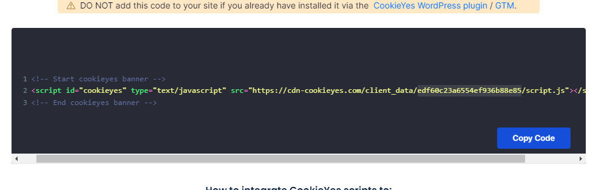

# TRANCE STACK [](https://meza.github.io/trance-stack/)

> **Warning**
> **This stack is typescript and NPM only for now.**
>
> The NPM requirement comes from the GitHub actions scripts. I will make it possible to use both pnpm and yarn soon, but it
> requires a bit more time and I would love to get feedback on the stack until then.

## Quick Start

Create your project with the stack
```bash
npx create-remix@latest --template meza/trance-stack my-app
```

Once it's done, go into the newly created directory and start the dev server
```bash
npm run dev
```

Please make sure that you go through the initialization steps of the create-remix script.

If for whatever reason it didn't run, execute the following commands:

```bash
npm i && remix init
```

---

## What is this stack?

This is a [Remix](https://remix.run) stack that offers _a_ way to ship production ready remix applications.
It is constructed in an opinionated way and is meant to be used as a starting point for your own remix projects.
You can modify it to your liking and use it as a base for your own remix projects.

## What's included

- Good security practices with CSP and sensible auth processes
- i18n with [i18next](https://www.i18next.com/) and its remix integration [remix-i18next](https://github.com/sergiodxa/remix-i18next)
- [Auth0](https://auth0.com/) for authentication
- [Split](https://split.io) for feature flags
- [CookieYes](https://cookieyes.com) for cookie consent
- Analytics Integrations
  - [Mixpanel](https://mixpanel.com)
  - [Hotjar](https://hotjar.com)
  - [Google Analytics v4](https://analytics.google.com)
- Static Types with [TypeScript](https://typescriptlang.org)
- Linting with [ESLint](https://eslint.org)
- Unit testing with [Vitest](https://vitest.dev) and [Testing Library](https://testing-library.com)
- End-to-End testing with [Playwright](https://playwright.dev)
- [Conventional Commits](https://www.conventionalcommits.org/en/v1.0.0/) for commit messages to enable automated versioning
- [Semantic Release](https://github.com/semantic-release/semantic-release) for automatic release management
- [Storybook v7](https://storybook.js.org) for component development
- [NPM](https://docs.npmjs.com/) for package management (for now. Will have support for [yarn](https://yarnpkg.com/) and [pnpm](https://pnpm.io/) soon)
- [GitHub Actions](https://github.com/features/actions) for a full CI setup
- [AWS](https://aws.com) deployment with [CDK](https://docs.aws.amazon.com/cdk/index.html) via [GitHub Actions](https://github.com/features/actions)
  - Using AWS Lambda + Api Gateway + Cloud Front for production builds
  - Using AWS Lambda + Api Gateway for ephemeral builds (for feature branches, pull requests, etc)
- Automatic dependency updates with [Renovate](https://www.mend.io/free-developer-tools/renovate)

## Getting Started

> **Note**
> Read this documentation on your own project's repository. It will contain links relevant to you as
> the init script will replace the links in this README with the ones customized to your project.

In order to fully use this stack, you will need to have a few things set up first.

The stack is designed in a way that makes it relatively simple to remove the parts you don't need. You will be able to
find removal instructions at every step so don't worry if you're not a fan of a particular service.

> #### But... why?
>
> We've been using [Architecture Decision Records](https://cognitect.com/blog/2011/11/15/documenting-architecture-decisions)
> throughout the development of the stack so if you ever find yourself wondering why we've chosen a particular service or
> implementation, you can check the [ADR](./doc/adr/decisions.md) page for more information.
>
> We highly encourage you to keep on adding your own decisions. It's a great way to document the historical context of your
> project, and it's a great way to share your knowledge with the rest of the team.
>
> We use [adr-tools](https://github.com/meza/adr-tools) to manage our ADRs. It is installed as part of the stack, so you
> should be able to use it right away.

> **Warning**
> This README isn't trying to teach you how to use these services, please refer to the services' documentation for that.


### Environment

If you went through the init script of the stack, you should have a `.env` file in the root of your project.
If for some reason you don't, you can copy the `.env.example` file and rename it to `.env`.

```bash
cp .env.example .env
```

This file contains all the variables you will need to set for the entire stack to function as is.

The `APP_DOMAIN` should generally stay the same. It's the domain that your application will be served from. This variable
will also be set by the deployment scripts, so you don't need to worry about it.

The `NODE_ENV` variable is used to determine which environment you're running the application in. It seems like ARC has a
hard time figuring it out on its own, so we've set it up to be set manually. If all goes well, it won't be needed for long.

The `SESSION_SECRET` variable is used to encrypt the session cookies. It should be a long, random string.

### GitHub Settings

> **Note**
> The stack is meant to be used with GitHub Actions. If you're not familiar with GitHub Actions, you can read more about it
> [here](https://docs.github.com/en/actions).

You need to do a few things to make sure GitHub Actions can work with your project.

#### Workflow permissions

First, head over to https://github.com/meza/trance-stack/settings/actions and under the `Workflow permissions`
section, make sure it's on the `Read and write permissions` option.

Without this, the deployment scripts won't be able to create the necessary GitHub releases.

#### Pages

Next, head over to https://github.com/meza/trance-stack/settings/pages and make sure the `Source` is set to `Github Actions`.
This will allow us to deploy the project's storybook to GitHub Pages.

#### Environments

> **Note**
> We use GitHub environments to manage the different stages of our application. You can read more about them
>[here](https://docs.github.com/en/actions/deployment/targeting-different-environments).

GitHub environments are great to control the environment variables that are used in your workflows.

For now, go to https://github.com/meza/trance-stack/settings/variables/actions and create the following environments:
- `Production`
- `Staging`
- `Ephemeral`

These are referred to in [the deployment workflow](./.github/workflows/deploy.yml) for example with the `environment` key.
The `Ephemeral` environment is used for feature branches and pull requests and is referenced in [the ephemeral workflow](./.github/workflows/ephemeralDeploy.yml).

#### Variables vs. Secrets

Some configuration values are sensitive while others are not. For example, the `COOKIEYES_TOKEN` is not sensitive, but the
`AUTH0_CLIENT_SECRET` is.
This mainly comes from the fact that some of these values will be embedded into the html of your application and be visible
to everyone.

> **Warning**
> Please double-check the documentation of the services to ensure you're setting them up correctly.
>
> The application won't work properly if you add a secret as a variable or a variable as a secret.

### Authentication with Auth0

The stack uses [Auth0 for authentication](./doc/adr/0010-authentication-is-done-by-auth0.md).
You will need to create an account with them and [set up an application](https://auth0.com/docs/get-started/auth0-overview/create-applications).

When creating your new application, make sure to set the following settings:
1. The application type should be `Regular Web Applications`
2. Ignore the Quick Start section
3. Go to Settings and copy the `Domain` and `Client ID` and `Client Secret` and paste them in the `.env` file
4. Set the Token Endpoint Authentication Method to `Post`
5. Go to the `Allowed Callback URLs` section and add `http://localhost:3000/auth/callback`
6. Go to the `Allowed Logout URLs` section and add `http://localhost:3000`
7. Go to the `Allowed Web Origins` section and add `http://localhost:3000`
8. Go to the `Allowed Origins (CORS)` section and add `http://localhost:3000`
9. Go to the `Refresh Token Rotation` section and enable it and with that, you also have to enable the `Absolute Expiration`
   option.

#### Adding the Auth0 variables to GitHub

Now that you have your Auth0 variables, you will need to add them to the GitHub environments you created above.

Go to https://github.com/meza/trance-stack/settings/secrets/actions and add the Auth0 secrets with the same name as the
variables in the `.env` file.

You can set custom values for every environment if you want to. For example, you can set the `AUTH0_DOMAIN` to
`dev-123456.eu.auth0.com` for the `Staging` environment and `prod-123456.eu.auth0.com` for the `Production` environment.

But for the sake of simplicity, you can just set the same values only once in the main Actions secrets page, and it will
be used for all environments.

#### Enabling the Auth0 integration for feature branch/PR deployments

If you want to enable the Auth0 integration for feature branch/PR deployments, you will need to do a few extra steps.
Since the feature branch/PR deployments are ephemeral, they will have a different domain name every time they are
deployed. This means that you will need to add the domain name to the `Allowed Callback URLs` and `Allowed Logout URLs`

To make this painless, we can use the `*` wildcard in the domain name. This will allow any domain name to be used.

During the initial setup above, you have added `http://localhost:3000` in a few places.
You will need to add `,https://*.execute-api.us-east-1.amazonaws.com` to the same places.
_(Note the comma at the beginning. Domains need to be separated by commas)_

> **Note**
> You will need to replace the `us-east-1` part with the region you're using. By default, the stack uses `us-east-1`.

For example, the Allowed Callback URLs section should look like this:

```text
http://localhost:3000/auth/callback,https://*.execute-api.us-east-1.amazonaws.com/auth/callback
```

> **Warning**
>
> The `*` wildcard will allow you to use as wide of a domain name as you would like to. This however comes at the cost
> of security. We would highly recommend creating an alternative tenant on Auth0 for your feature branch/PR deployments.

#### Removing the Auth0 integration from the application

1. Delete the `AUTH0_DOMAIN`, `AUTH0_CLIENT_ID` and `AUTH0_CLIENT_SECRET` variables from the `.env` file and GitHub secrets.
2. Delete the `src/auth.server.ts` and the `src/auth.server.test.ts` files.
3. Delete the `auth0-remix-server` dependency from the `package.json` file.
4. Follow the compilation errors to remove all the code that uses the `auth0-remix-server` dependency.

### CookieYes integration

The stack uses [CookieYes](https://www.cookieyes.com) for cookie consent. You will need to create an account with them and
[set up a cookie banner](https://www.cookieyes.com/category/documentation/getting-started/).

When you are prompted with installation instructions or navigate to https://app.cookieyes.com/site-settings, you will need
to copy the code following the `client_data/` in the script src and paste it in the `.env` file:

<p align="center">
  
</p>

You will also have to go to https://github.com/meza/trance-stack/settings/variables/actions and add the same variable
name as the one in the `.env` file.

> **Warning**
> The `COOKIEYES_TOKEN` is **set as a variable** for the actions.

#### Removing the CookieYes integration from the application

1. Delete the `COOKIEYES_TOKEN` variable from the `.env` file and GitHub variables.
2. Delete the `src/components/Cookieyes` directory.
3. Delete the relevant types off the `appConfig` type in the `src/types/global.d.ts` file.
4. Delete the `<Cookieyes ... />` component and its import from the `src/root.tsx` file.
5. Run `vitest --run --update` to update the snapshots.

### Google Analytics 4 integration

The stack uses [Google Analytics v4](https://analytics.google.com) for analytics. You will need to create an account with them
and [set up a property](https://support.google.com/analytics/answer/1008015?hl=en).

When you are done setting up your property, you will need to copy the `Measurement ID` of your Data Stream and paste
set the `GOOGLE_ANALYTICS_ID` variable in the `.env` file.

You will also have to go to https://github.com/meza/trance-stack/settings/variables/actions and add the same variable
name as the one in the `.env` file.

> **Warning**
> The `GOOGLE_ANALYTICS_ID` is **set as a variable** for the actions.

#### Removing the Google Analytics 4 integration from the application

1. Delete the `GOOGLE_ANALYTICS_ID` variable from the `.env` file and GitHub variables.
2. Delete the `src/components/GoogleAnalytics` directory.
3. Delete the relevant types off the `appConfig` type in the `src/types/global.d.ts` file.
4. Delete the `<GoogleAnalytics ... />` component and its import from the `src/root.tsx` file.
5. Run `vitest --run --update` to update the snapshots.

### Hotjar integration

The stack uses [Hotjar](https://www.hotjar.com) for heatmaps and user recordings. You will need to create an account with them
and set up a new site.

When you have your site set up, head to https://insights.hotjar.com/site/list and copy the ID of your site and paste
set the `HOTJAR_ID` variable in the `.env` file.

You will also have to go to https://github.com/meza/trance-stack/settings/variables/actions and add the same variable
name as the one in the `.env` file.

> **Warning**
> The `HOTJAR_ID` is **set as a variable** for the actions.

#### Removing the Hotjar integration from the application

1. Delete the `HOTJAR_ID` variable from the `.env` file and GitHub variables.
2. Delete the `src/components/Hotjar` directory.
3. Delete the relevant types off the `appConfig` type in the `src/types/global.d.ts` file.
4. Delete the `<Hotjar ... />` component and its import from the `src/root.tsx` file.
5. Run `vitest --run --update` to update the snapshots.

### Mixpanel integration

The stack uses [Mixpanel](https://mixpanel.com) for analytics. You will need to create an account with them
and set up a new project.

When you have your project set up, head to project settings and copy the `Project Token` and paste it
set the `MIXPANEL_TOKEN` variable in the `.env` file.

Mixpanel allows you to choose the region where your data is stored. You can find the API endpoint for your region in the
[documentation](https://help.mixpanel.com/hc/en-us/articles/360039135652-Data-Residency-in-EU).

You also need to set the `MIXPANEL_API` variable. This is the API endpoint that the stack will use to send events to Mixpanel.
There is no default value to this because you should understand how you're dealing with data residency.

The values for the `MIXPANEL_API` variable are:
- `https://api-eu.mixpanel.com` - for the European Union
- `https://api.mixpanel.com` - for the rest of the world


You will also have to go to https://github.com/meza/trance-stack/settings/variables/actions and add the same variable
names as the one in the `.env` file.

> **Warning**
> The `MIXPANEL_TOKEN` and the `MIXPANEL_API` are **set as a variable** for the actions.

#### Removing the Mixpanel integration from the application

1. Delete the `MIXPANEL_TOKEN` and `MIXPANEL_API` variables from the `.env` file and GitHub variables.
2. Delete the `src/components/Mixpanel` directory.
3. Delete the relevant types off the `appConfig` type in the `src/types/global.d.ts` file.
4. Delete the `<Mixpanel ... />` component and its import from the `src/entry.client.tsx` file.
5. Run `vitest --run --update` to update the snapshots.

### Split integration

The stack uses [Split](https://split.io) for feature flags. You will need to create an account with them
and set up a new project.

When you have your project set up, head to the workspace settings > API Keys section.
We're only interested in the server-side keys. Copy the `API Key` and paste it
set the `SPLIT_SERVER_TOKEN` variable in the `.env` file.

Go to https://github.com/meza/trance-stack/settings/secrets/actions and add the Auth0 secrets with the same name as the
variables in the `.env` file.

> **Warning**
> The `SPLIT_SERVER_TOKEN` is **set as a secret** for the actions.

#### Removing the Split integration from the application

1. Delete the `SPLIT_SERVER_TOKEN` variable from the `.env` file and GitHub secrets.
2. Delete the following files:
   1. `src/split.server.ts` and the `src/split.server.test.ts`
   2. `src/feature.ts` and the `src/feature.test.ts`
   3. `devFeatures.yml` (from the project root)
3. Follow the compilation errors to remove all the code that uses the feature flags.
4. Run `vitest --run --update` to update the snapshots.

## How to use ... ?

### Authentication

The authentication is done via the [auth0-remix-server](https://github.com/meza/auth0-remix-server) package.
The README file in that package has all the information you need to understand how it works.

### Conventional Commits & Automated Semantic Versioning

The stack uses [Conventional Commits](https://www.conventionalcommits.org/en) to automatically determine the next
version of the package. It uses the [semantic-release](https://semantic-release.gitbook.io/semantic-release) package to
automate the versioning and release process.

The functionality is controlled by the `<project_root>/.releaserc.json` file.
Since the projects that are created from this stack are most likely aren't going to be npm libraries, the npm publishing
plugin is not included in the configuration.

To effectively use conventional commits, you need to understand the following basic principle:

**Your commit messages determine if a new deployment happens to production.**

Messages that trigger builds are:
- `fix: ...` - fixes a bug
- `feat: ...` - adds a new feature

Messages that don't trigger new versions (therefore builds) are:
- `docs: ...` - changes to the documentation
- `chore: ...` - changes to the build process or auxiliary tools and libraries such as documentation generation
- `refactor: ...` - code changes that neither fixes a bug nor adds a feature
- `style: ...` - changes that do not affect the meaning of the code (white-space, formatting, missing semi-colons, etc)
- `test: ...` - adding missing tests or correcting existing tests
- `ci: ...` - changes to the CI configuration files and scripts
- `perf: ...` - a code change that improves performance

### Branching Strategy with Semantic Versioning

We will talk about how the deployment works in the [Deployment](#deployment) section. For now, let's look at how the
branching strategy works with the versioning.

There are 3 main branches:
- `main` - this is the main branch. It is the branch that is deployed to production.
- `beta` - this is the branch that is deployed to the beta (Staging) environment.
- `alpha` - this is the branch that is deployed to the alpha (Staging) environment.

When you push to the `main` branch, a new version is released to production. The version is determined by the commit messages
and every commit that is pushed to the `main` branch will trigger a new version.

When you push to the `alpha` or `beta` branch, a new [Pre-release](https://semantic-release.gitbook.io/semantic-release/usage/workflow-configuration#pre-release-branches)
version is created. This allows you to iterate on features for an upcoming release and not worry about bumping the version
number every time you push a commit that introduces a new feature or a fix.

For example if you have a `1.0.0` version in production, and you push a commit to the `alpha` branch, the version will be
`1.1.0-alpha.0`. If you push another commit to the `alpha` branch, the version will be `1.1.0-alpha.1` and so on.

When you merge a pull request from the `alpha` or `beta` branch to the `main` branch, all the changes in those branches
will be collected and bundled into a single release. To follow the example above, if you have a `1.0.0` version in production,
and merge the `alpha` branch with its `1.1.0-alpha.1` version, your newly created version on production will be `1.1.0`.

#### Linting

We use [commitlint](https://commitlint.js.org/#/) to lint the commit messages. The configuration is in the
`package.json` file.
The linting happens whenever you make a commit. If the commit message doesn't follow the conventional commits format,
the commit will fail.

The linting itself is triggered by [lefthook](#lefthook)

#### Which version am I running?

The version of the app is sent into the `<html data-version="...">` attribute. You can use this to determine which version
of the app is running on any given environment.


### Dependency Version Updates

### Feature Flags

Feature flags are a fantastic way to test new features in production without having to worry about breaking anything.
It enables you to decouple the release of new code from the release of new features. [Read more](https://www.split.io/product/feature-flags/)

Let's look at an example which is in the `src/routes/index.tsx` file

```tsx
export const loader: LoaderFunction = async ({ request, context }) => {
  const isAuth = await hasFeature(request, Features.AUTH);
  return json({
    isHelloEnabled: await hasFeature(request, Features.HELLO),
    isAuthEnabled: isAuth
  });
};

export default () => {
  const { isHelloEnabled, isAuthEnabled } = useLoaderData<typeof loader>();
  if (isHelloEnabled) {
    return (<div>
      <Hello/>
      {isAuthEnabled ? <Login/> : null}
    </div>);
  }
  return <div>Goodbye World!</div>;
};
```

Here all elements of the page are wrapped in a feature flag. The `Hello` component will only be rendered if the `HELLO`
feature is enabled. The `Login` component will only be rendered if the `AUTH` feature is enabled.

Don't worry about using `hasFeature` a lot in your code. Split caches the results of the feature flags, so it's not a
performance issue. Split works with streaming data and will check for changes in the feature flags every minute by default.

You can check all the available options in the [Split documentation](https://help.split.io/hc/en-us/articles/360020564931-Node-js-SDK#configuration),
and then set them as you wish in the `src/split.server.ts` file.

Before we continue, let's talk about the difference between production and local development.

#### Production

When you're running the application in production, the `SPLIT_SERVER_TOKEN` variable is set to the API key of your Split.
You also need to manage all your flags (or splits as they're called in Split) in the Split Workspace dashboard.

Always use the Splits of your workspace as the source of truth.

#### The `features.ts` file

The `features.ts` file is a list of all the features that you have in your application. It's a good idea to keep this file
in sync with the Splits in your workspace. This way you can easily see which features are available and which are not.

```ts
// <project_root>/src/features.ts
export enum Features {
  AUTH = 'auth_enabled', // the name of the split from the split.io workspace
  HELLO = 'hello_split'
}
```

Having this allows us to reference the features in our code without having to worry about typos.

#### Local development

When you're developing locally, you can set the `SPLIT_SERVER_TOKEN` variable to `localhost`.
This sets split into a [localhost mode](https://help.split.io/hc/en-us/articles/360020564931-Node-js-SDK#localhost-mode),
and it will use the `devFeatures.yml` file to determine if a feature is enabled or not. This file is located in the project root.

```yml
# <project_root>/devFeatures.yml

- auth_enabled:
    treatment: "on"
- hello_split:
    treatment: "on"
```

This file is a list of all the features that you have in your application. The `treatment` property determines if the
feature is enabled or not. If the treatment is set to `on`, the feature is enabled. If it's set to `off`, the feature is
disabled. [Read more about treatments](https://docs.split.io/reference/treatment) as they can be more than just `on` and `off`.

> **Warning**
> Unfortunately there is no simple way to keep the `devFeatures.yml` file, the `src/features.ts` final
> and the Splits in your split.io workspace in sync. You will have to do this manually.

### I18N - Internationalization

We're using i18next for internationalization. You can read more about it in the [i18next documentation](https://www.i18next.com/).
To integrate it with Remix, we're using the [remix-i18next](https://github.com/sergiodxa/remix-i18next) package and our setup
is based on the remix-i18next Readme file.

You can find the i18n configuration in the `src/i18n` directory. The `i18n.config.ts` file contains the configuration for
the defaults of i18next. The `i18n.server.ts` file contains the configuration for the server side while the `i18n.client.ts`
file contains the configuration for the client side.

The only deviation we have from the remix-i18next sample setup is that we're actually bundling the translations into the
server package. This is done in the `src/i18n/i18n.server.ts` file.

```ts
await i18nextInstance.init({
      debug: process.env.I18N_DEBUG === 'true',
      ...baseConfig,
      lng: locale,
      ns: remixI18next.getRouteNamespaces(remixContext),
      // The sample setup in remix-i18next
      //backend: {
      //  loadPath: resolve("./public/locales/{{lng}}/{{ns}}.json"),
      //},
      resources: {
        en: {
          translation: en
        }
      }
    });
```
We're doing this because in the [AWS Lambda](https://aws.amazon.com/lambda/) environment, we have one single file as the
handler, and it needs to be self-contained. While traditional lambda functions could have access to attached file systems,
it would make deployments more complicated and the function would become incompatible with [Lambda@Edge](https://aws.amazon.com/lambda/edge/) solutions.

Therefore instead of using the `fs-backend`, we're directly importing the resources from the `public/locales` directory.

This does mean that when you add a new locale, you will have to add it to the resources in the `i18n.server.ts` file.

#### Using translations

To use translations in your application, you can use the `useTranslation` hook from the `react-i18next` package.

```tsx
import { useTranslation } from 'react-i18next';

export const Hello = () => {
  const { t } = useTranslation();
  return (
    <h1 data-testid={'greeting'} className={'hello'}>{t('microcopy.helloWorld')}</h1>
  );
};
```

You can also [pass in variables](https://www.i18next.com/translation-function/interpolation#working-with-data-models) to the translations. This helps the translators to create more context-sensitive translations.

Take this example from the initial logged in Dashboard of the application:
```tsx
export default () => {
  const { t } = useTranslation();
  const { user } = useLoaderData<typeof loader>();
  return (<>
    <div>{t('dashboard.for', { name: user.nickname || user.givenName || user.name })}<br/><Logout/></div>
  </>);
};
```

Here we pass in the `name` variable to the translation. This means that the location of where the name appears in the final
text can be different in different languages. For example, in one context we could say "Dashboard for John!" and in another context
we could say "John's dashboard!".

The translation file in our dashboard's case looks like this:

```json
{
  "dashboard": {
    "for": "Dashboard for {{ name }}"
  }
}
```

#### Adding a new locale

To add a new locale, you will have to do the following:

1. Add the new locale to the `<project_root>/public/locales` folder. Follow the example of the existing locale(s)
2. Add the new locale to the `resources` object in the `i18n.server.ts` file.
3. Add the new locale to the `supportedLngs` array in the `i18n.config.ts` file.

#### Removing i18n from your project

If you don't want to use i18n, you can remove it from your project. You will have to do the following:

1. Remove the `i18n` folder from the `src` directory
2. Remove the `locales` folder from the `public` directory
3. Run `npm remove i18next i18next* *i18next`
4. Remove the `<<I18nextProvider ...>` from both the `src/entry.server.tsx` and `src/entry.client.tsx` files
5. Follow the compilation errors and remove any remaining references to i18n

> **Note**
>
> There are some great tips about organising your translations in the
> [i18n Readme file](./src/i18n/README.md).

### Styling / CSS

We use regular stylesheets in this stack which means a combination of [Shared Component Styles](#shared-component-styles)
and [Surfacing Styling](#surfacing-styling).

#### Shared Component Styles

The shared component styles live in the `src/styles` directory. They are imported in the routes that use them.

```ts
// src/root.tsx
import styles from './styles/app.css';

export const links: LinksFunction = () => {
  return [
    { rel: 'stylesheet', href: styles }
  ];
};
```

The styles that are uniform across the entire application are loaded from the `src/root.tsx` file while the styles that are
specific to a single route are loaded from the route itself.

These are all additive, so you can have a single stylesheet that is loaded on every route via the `root.tsx`, and then
additional stylesheets that are loaded on specific routes.

If you need a component-specific stylesheet, you can use the [Surfacing Styling](#surfacing-styling) method.

#### Surfacing Styling

To have local styles per component, we use is [Surfacing Styling](https://remix.run/docs/en/main/guides/styling#surfacing-styles).

> _Because these are not routes, and therefore not associated with a URL segment, Remix doesn't know when to prefetch,
> load, or unload the styles. We need to "surface" the links up to the routes that use the components_

This solution is a bit more complex, but it allows us to have styles that are only loaded when the component is loaded.

Take the `Hello` component as an example:

```tsx
import { useTranslation } from 'react-i18next';
import styles from './hello.css';

export const links = () => [
  { rel: 'stylesheet', href: styles }
];

export const Hello = () => {
  const { t } = useTranslation();
  return (
    <h1 data-testid={'greeting'} className={'hello'}>{t('microcopy.helloWorld')}</h1>
  );
};

export default Hello;
```

Notice that it imports the `hello.css` file. This file is located in the same directory as the component.
It also has a `links` export that returns the stylesheet link.

In Remix terms however, a component is not a route, so we need to "surface" the links up to the routes that use the components.
You can see an example of this in the `src/routes/index.tsx` file:

```tsx
import { Hello, links as helloLinks } from '~/components/Hello';

export const links: LinksFunction = () => ([
  ...helloLinks()
]);
```
We import the `links` export from the `Hello` component and add it to the `links` export of the `index.tsx` route.

Yes, this is more complicated than it should be but with the rapid development of Remix, we hope that this will be
simplified in the future.

#### PostCSS
This stack uses [PostCSS](https://postcss.org) to process CSS. Remix has a built-in PostCSS plugin that allows you to
import CSS files directly into your components. Read more about how [CSS in Remix](https://remix.run/docs/en/main/guides/styling#built-in-postcss-support) works.

Our PostCSS configuration is located in the `postcss.config.js` file, and it gets applied every single time Remix builds
the application.
This means that you don't have to think about prefixes or other browser-specific CSS features. Just write your CSS and
PostCSS will take care of the rest automagically.

### Deployment

#### CDK

#### GitHub Actions

### Storybook

### Playwright

### Unit Testing

### Lefthook

---

<!-- stack-only -->

### Development of the stack itself (delete everything below when using this for an app)

---

> **Note**
>
>A note on lockfiles.
>
> Since this is a "create" package, lockfiles are not included. This is to ensure that the latest versions of
> dependencies are used when creating a new project.
