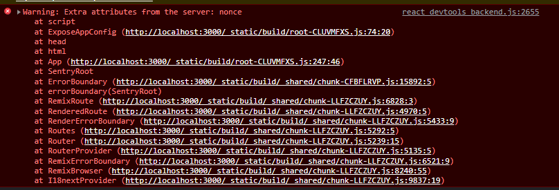

# 11. Suppressing Hydration Warnings on Scripts

Date: 2023-03-10

## Status

Accepted

## Context

When using the app in development mode, the console is filled with hydration warnings.
This usually is because the server and client render different content.

In this case however the error stems from a change in the [DOM specification](https://github.com/whatwg/html/pull/2373)
which aims to reduce attack vectors by removing the nonce attribute from elements.

This inadvertently causes differences between the server and the client side and React freaks out.

There is an [outstanding issue](https://github.com/facebook/react/issues/26028) to look into the problem.

We had
a [solution](https://github.com/meza/trance-stack/blob/12907646f56f58c604a1eaeae68f1549d9b570ec/src/components/StaticContent/StaticContent.tsx)
for this that was taken from a [stackoverflow post](https://stackoverflow.com/a/60365819).

This solution worked, but it seemed to be introducing a lot of "magic" to mask the problem.

## Decision

After some discussion, we decided to do the same
thing [Remix does](https://github.com/remix-run/remix/blob/8a07860f3eea1cbfc2c67d0018cb9ac76c6df9d1/packages/remix-react/scroll-restoration.tsx#L70)
and suppress the warnings at the script level without any additional magic.

## Consequences

- We will no longer see hydration warnings in development mode.
- We have to keep an eye on the React issue to see if they come up with a better solution.
